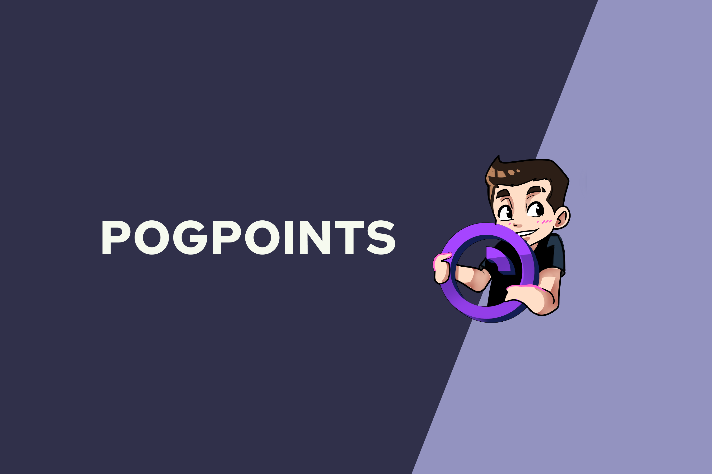

# PogPoints



PogPoints is a Twitch Channel Points integration that allows you to run draws and giveaways (PogPrizes) on your stream for new ways to interact with and engage with your audience. Viewers redeem channel points for tickets and streamers use the PogPoints desktop application to manage and showcase PogPrizes on their streams.

## What it does

PogPoints is an application that integrates with the Twitch Channel Points API to allow streamers to run draws or giveaways (PogPrizes).

![dashboard-2]\(images/dashboard-2)

> Tip: Many popular extensions utilize animations. This is an excellent way to show off your extension! We recommend short, focused animations that are easy to follow.

## Running the repo

### Downloading the source code

#### Clone the repository:

```
git clone https://github.com/uyxela/pogpoints
cd pogpoints
```

#### To run PogPoints locally:

```
cd application
yarn
yarn start
```

## Contributors to PogPoints

- [Alex Yu](https://github.com/uyxela)
- [Aryan Misra](https://github.com/aryanmisra/)
